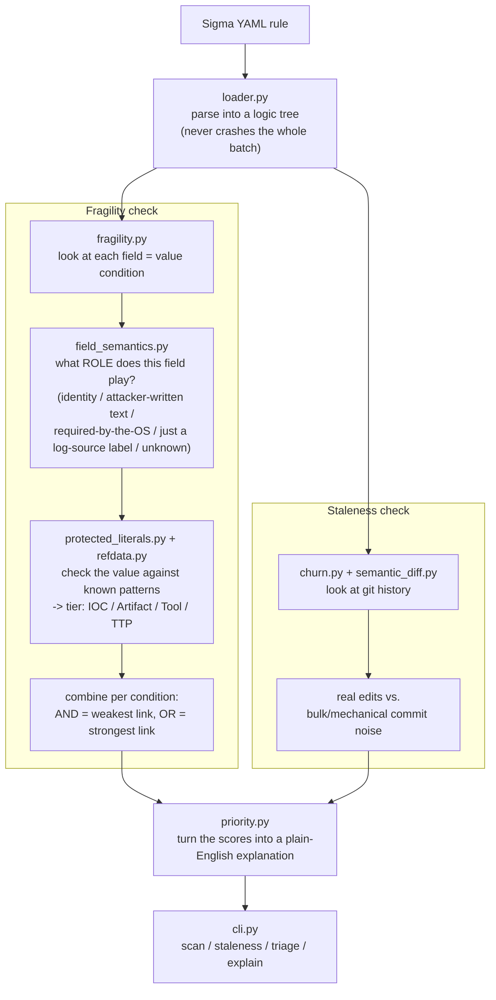

# mechanic

Detection rule maintenance triage — tells you which of your Sigma detection
rules are weak (easy for an attacker to slip past) or stale (nobody's kept
them up to date), so you know which ones to look at first.

## What this is

The core tool does three things:

1. **Loads a folder of Sigma rules without crashing** on the bad/malformed
   files real-world rule repos always have a few of.
2. **Checks each rule's real git history** to see if it's actually been
   maintained — not just counting commits, since a single bulk reformat can
   touch thousands of files and make a repo look far more "active" than it is.
3. **Scores how easy each rule is to bypass**, based on the rule's actual
   logic (parsed into a real tree), not just text matching. This score is
   checked against MITRE's own "Summiting the Pyramid" methodology, using
   MITRE's own expert-scored data (Kendall's tau-b = 0.3117, p = 0.0052 —
   full numbers in `RESULTS.md`).

The bypass-difficulty score is only fully trusted for **Sigma** rules, on
purpose — Sigma is the only format this tool can parse into a real logic
tree, so it's the only format where that score has actually been validated.
A rougher, lower-confidence version exists for Elastic and Splunk rules too,
but it's kept in a separate folder (`mechanic/experimental/multiformat/`)
and never mixed into the main results — see `docs/multiformat-experimental.md`.

Runs fully offline: no network calls, no API key, enforced by an automated
test (`tests/test_core_isolation.py`). See `QUICKSTART.md` for five real
commands to try against a real SigmaHQ checkout.

One gap is left open on purpose rather than hidden: Elastic/Splunk bypass
scoring won't reach the same confidence level until this project has a real
parser for those formats (Elastic's own KQL parser is the likely path;
Splunk's query language has no equivalent yet).

*Historical note:* an earlier, separate experiment tried automatically
*repairing* weak rules and verifying the fix with a real detection engine.
It ran to completion (a 3.6% acceptance rate, 1 of 28 sample rules) but was
never part of the core tool, and its code has since been removed from this
repository.

**Mechanic checks:**
- **Staleness** — is the rule actually maintained? (`churn.py`, works on any
  of the four supported rule formats)
- **Fragility** — how easy is the rule to bypass? (`fragility.py`, Sigma
  only in the core, validated against MITRE STP)
- **A review-priority ordering** built from those two (`priority.py`) —
  shown side by side, never combined into one number (see below for why)

**Mechanic does NOT check:**
- ATT&CK technique coverage or mapping quality
- Whether a rule would survive a specific, real attacker (that needs a
  manual test, not a repo-wide scan)
- Elastic/Splunk fragility at the same confidence as Sigma — the core tool
  refuses those formats outright (`mechanic triage --fmt elastic_toml`
  fails cleanly rather than guessing)

## Why this exists

Two problems, found while testing this against five real rule repositories:

1. **Sigma's own parsing library isn't crash-resistant.** One malformed
   file (a bad ID field, a broken date, a malformed correlation rule) can
   kill the whole batch load — and the library's built-in error handling
   doesn't catch every kind of crash real-world files trigger.
2. **Counting git commits doesn't tell you if a rule is maintained.** Big
   repos run mass mechanical commits — bulk reformats or metadata
   migrations touching thousands of files at once (SigmaHQ: 2,931 files in
   a single commit). Those swamp any real signal about which rules people
   actually revise.

`mechanic` fixes both: it won't crash on bad files, and it filters out
mechanical noise before measuring how well-maintained a rule really is.

## How it works



Two independent checks feed one output: **fragility** (how easy is this
rule to bypass) and **staleness** (has this rule actually been maintained).
`priority.py` is the only place they come together — and even there, they
stay two separate numbers shown side by side, never merged into one score
(see "Priority / triage" below for why).

## Components

### 1. A rule loader that doesn't crash (`mechanic/loader.py`, `mechanic/categories.py`)

Two layers of safety:

- **Per file** — if one file fails to parse, the rest of the batch keeps
  going, and a crash in one document of a multi-document file doesn't stop
  the other documents in it.
- **Per rule, per validator** — if a specific validator crashes on one
  rule, every other rule still gets validated normally.

Every failure is recorded: which file, what stage it failed at, what
category of problem it was, the exact error, and (where possible) a
suggested fix. Seven known problem categories are built in; anything else
still gets captured under an "uncategorized" bucket instead of being
silently dropped.

| category | trigger |
|---|---|
| `bare_int_id` | `id:` is a plain number instead of a UUID |
| `correlation_as_standard_rule` | `correlation:` key exists but isn't formatted correctly |
| `yaml_scanner_error` | Bad YAML syntax (tabs, bad tokens) |
| `yaml_composer_error` | An unquoted value starting with `*` gets misread as a YAML alias |
| `yaml_parser_error` | Malformed YAML block structure |
| `null_date_split` | `date:`/`modified:` field is present but empty |
| `null_reference_typeerror` | An empty entry in `references:` crashes the link-checker |

New categories can be added just by appending to a list — nothing in the
loader itself needs to change.

`mechanic scan <repo>` runs all of this and always gives you a clean
summary — never a raw crash — no matter how messy the input is.

### 2. Staleness (`mechanic/churn.py`)

Reads git history directly (via `pydriller`, no manual git parsing).
Before computing anything, it filters out **mechanical commits** — any
single commit that touches 10%+ of all rule files at once, since that's a
bulk reformat or migration, not a real edit. That 10% threshold can be
changed with `--mechanical-threshold`, and every run also reports the
numbers at 5%, 10%, and 20% side by side so the choice is never a black box.

For each rule, after filtering out the noise, it reports: how many real
edits it's had, when the last real edit was, how long ago that was, whether
it's ever been revised at all, and how many different people have touched
it.

**One honest limitation:** if a rule was first added as part of a bulk
commit (very common — that's how most of these repos onboarded their first
few thousand rules) and then edited exactly once since, it looks identical
in the data to a rule that was added normally and never touched again —
both show "1 real commit." There's no way to tell those two cases apart
from git history alone, and this tool says so rather than guessing.

It also refuses to give you a wrong number instead of an honest failure:
a shallow git clone (truncated history) or a repo with no git history at
all makes it stop and tell you, rather than silently reporting staleness
figures that are too low.

### 3. Turning a rule into a logic tree (`mechanic/ast_repr.py`)

Every loaded rule is converted into a tree: AND/OR/NOT as structure, and
`field = value` pairs as the leaves, each one correctly marked as negated
or not — so a condition buried inside something like `not (a or b)` is
still flagged correctly, no matter how deeply nested it is. This reuses
Sigma's own official parser rather than a hand-written one, so it stays
correct as the Sigma format itself evolves.

### 4. Command line (`mechanic/cli.py`)

```
mechanic scan <path>        # load report + what broke
mechanic staleness <path>   # staleness report
mechanic ast <file>         # see one rule's logic tree
mechanic report <path>      # scan + staleness together
```

Useful flags: `--json` (machine-readable output, every command), `--top N`
(show only the N stalest rules), `--fmt` (which rule format), 
`--mechanical-threshold` (staleness sensitivity), `--subdir` (only look at
part of a repo).

`staleness` works on any supported rule format (Sigma, Elastic, Splunk).
Everything that needs real parsing — `scan`, `ast`, `triage`, `explain`,
`report` — is Sigma-only, because Sigma is the only format with a real
parser here.

### 5. Priority / triage (`mechanic/priority.py`)

```
mechanic triage <path>   # staleness + fragility, side by side, sorted for review
mechanic explain <file>  # plain-English explanation for one specific rule
```

**On purpose, this does not compute one combined score — that's a finding,
not a missing feature.** The original plan was to merge staleness and
fragility into one weighted priority number. A dedicated experiment testing
whether the two actually move together found no meaningful relationship in
the one dataset with real validated fragility scores (SigmaHQ), and a real
relationship in another (Elastic) that runs the wrong direction to justify
combining them. So instead of inventing a formula the data doesn't support,
`triage` reports both numbers side by side, sorted by fragility first (the
only axis that's externally validated) with staleness as a tie-break.

Other things `triage`/`explain` do:
- Put every unscoreable rule in its own section, with the specific reason —
  never guess a tier for a rule mechanic can't actually assess.
- Suggest loose, labeled-as-untested hypotheses (`likely-repairable`,
  `likely-needs-telemetry-check`, `likely-retire`) from simple threshold
  rules — never presented as a verdict on any individual rule.
- `mechanic explain <file>` writes a few plain-English sentences on what's
  actually going on with that one rule, then shows the full detail
  underneath for anyone who wants to check the reasoning against the raw
  data.
- Git history is cached to disk, so re-running `triage`/`explain` — or
  trying a few different threshold values — doesn't re-scan the whole
  repo's history every time.

**Priority labels (CRITICAL/HIGH/MEDIUM/LOW)** come from a fixed lookup
table combining the two scores — never a hidden formula. Run
`mechanic priority-legend` any time to see the exact table, no repo needed.

### 6. GUI (`mechanic gui`)

```
mechanic gui   # opens http://127.0.0.1:8642/ in your browser
```

A local, offline web interface over the exact same engine the CLI uses — no
repair feature, no network calls, no API key. Shows a repo overview, a
sortable/filterable table of every rule's priority, and a detail view per
rule (the same explanation `mechanic explain` prints). Install with
`pip install "mechanic[gui]"`. Full details: `docs/gui-notes.md`.

## JSON output

Every command supports `--json` for scripting. Full field-by-field shapes
for `scan`, `staleness`, `ast`, `triage`, `explain`, and `priority-legend`
are documented in the codebase and stay stable across releases — see
`mechanic/priority.py` and `mechanic/cli.py` for the exact schema, or run
any command with `--json` against a real repo to see it directly.

A couple of fields are worth knowing about specifically if you're
scripting against the output:
- **`fragility.caveat`** is non-null only when a tier came from the
  lower-confidence Elastic/Splunk text path, never from the core Sigma
  path — check it before trusting a tier at face value.
- **`priority.label`** always comes with `priority.tier` and
  `priority.staleness_band` — the two raw inputs that produced it. Never
  display the label alone.

## Prior art

**Summiting the Pyramid (STP)** — MITRE Center for Threat-Informed
Defense's published methodology (currently v4.0) for scoring how hard a
detection rule is to evade
(https://ctid.mitre.org/projects/summiting-the-pyramid/). mechanic's
IOC/Artifact/Tool/TTP tiers were built independently but measure the same
thing STP formalized first — see `RESULTS.md` and `data/STP_MAPPING.md`
for the full comparison, including a known, unresolved difference in how
mechanic combines multiple conditions in one rule versus STP's own rule.
SigmaHQ has formally adopted STP: it's a defined tag in the official Sigma
spec.

Related prior work, addressing different pieces of the same
detection-quality problem (linting, evasion testing, automated repair,
rule generation, mutation testing): sigmalint, EvoSIEM, Uetz et al.,
GRIDAI, RuleGenie, and ARMS.

## Stage 3 (historical — removed from the codebase)

An earlier, separate experiment tried automated rule repair (a
verification harness, an evasion generator, an LLM repair generator). It
ran to completion with an honestly-measured result (3.6% acceptance rate)
recorded in `RESULTS.md` for the historical record, but the code has since
been removed from this repository — it was never part of the core tool.

## Explicitly out of scope for this stage

No ATT&CK technique-coverage analysis, no evasion generation, no automated
repair, and nothing that judges whether a rule is "good" in any broader
sense than the two specific checks above.

## Running

```
pip install -e .[dev]
mechanic scan  /path/to/rules
mechanic staleness /path/to/repo --subdir rules
pytest tests/
```

See `RESULTS.md` for the full five-repo validation run.
